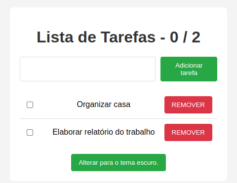
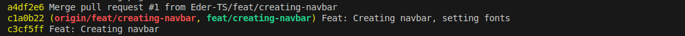
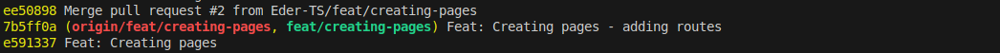
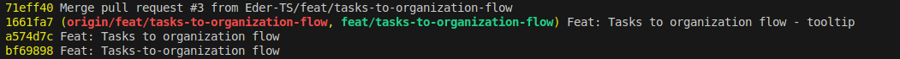

# **Q-fazer**

Aplicação para lista de tarefas.

## **Requisitos**

Projeto desenvolvido em Javascript com React + Typescript + Vite. Necessário NodeJS instalado.<br>
Esta versão da aplicação foi desenvolvida com NodeJS versão 20.12.0, ReactJS versão 19.0.0, ReactDom versão 19.0.0, React Router DOM versão 7.1.0, Typescript versão 5.7.3 e Vite versão 5.4.9.
Testes realizados nos navegadores Google Chrome versão 127.0.6533.88 e Firefox versão 133.0.3 .<br>
Para executar o projeto deve-se usar o comando `npm run dev` na linha de comando (estando dentro da pasta do projeto).

## **Melhorias com relação a Versão 1**

A versão anterior disponibiliza uma lista com opção de adicionar novos itens e marcar os itens já executados, além de poder remover qualquer item. Tudo salvo na memória do navegador (localStorage).<br>
<br><br>
Nesta nova versão as informações ainda são salvas no localStorage, porém foi adicionada uma página onde são listadas as organizações às quais tarefas específicas podem ser adicionadas, sendo cada lista de tarefas associada a apenas uma organização.<br><br>
<br>
Página de organizações<br><br>
<br>
Em destaque a organização à qual as tarefas se referem<br><br>
Inicialmente foi adicionado uma navabar com os botões para alternar entre as páginas.<br>
<br><br>

```
export const Navbar = () => {

const { theme, toggleTheme } = useTheme()

const organization = ''

const tasks = ''

const actualTab = window.document.location.href.endsWith('/')

    return (
        <nav className={`navbar ${theme}`}>
            <NavbarButton
                href='/'
                linkText='Organização'
                isActive={
                    actualTab ? 'active' : ''
                }
            />

            <NavbarButton
                href='/tarefas'
                linkText='Tarefas'
                isActive={
                    actualTab ? '' : 'active'
                }
            />
        </nav>
    )

}
```

Código navbar<br><br>

```
export function NavbarButton(props: NavbarButtonProps) {
    const { href, linkText, isActive } = props

    // eslint-disable-next-line @typescript-eslint/no-unused-vars
    const { theme, toggleTheme } = useTheme()

    return (
        <Link
            className={`button ${theme} ${isActive}`}
            to={href}
        >
            {linkText}
        </Link>
    )
}
```

Código botôes de navegação<br><br>

```
export interface NavbarButtonProps {
  href: string;
  linkText: string;
  isActive: "active" | "";
}
```

Um tipo também foi criado para definir os botões de navegação<br><br>
Então foram criadas as páginas.<br>
<br><br>
O corpo da página de Organizações é semelhante a página de Tarefas que herdou o código da versão 1.<br>

```
return (
        <div className={`app ${theme}`}>

            <Navbar />

            <div className={`container ${theme}`}>

                <h1>Lista de Organizações</h1>

                <div className='input-container'>
                    <input type="text" value={newOrganization} onChange={(e) => setNewOrganization(e.target.value)} />
                    <button onClick={addOrganization}>Adicionar organização</button>
                </div>

                <ol>
                    {
                        organizations.map((organization) => (
                            <li key={organization.id}>
                                <input
                                    type="radio"
                                    name='organization'
                                    value={organization.name}
                                    checked={selectedOrganization === organization.name}
                                    onChange={selectOrganization}
                                />

                                <span style={{ textDecoration: organization.done ? 'line-through' : 'none' }}>
                                    {organization.name}
                                </span>

                                <button onClick={() => removeOrganization(organization.id)}>REMOVER</button>
                            </li>
                        ))
                    }
                </ol>

                <button onClick={toggleTheme}>
                    Alterar para o tema {theme === "dark" ? "claro." : "escuro."}
                </button>
            </div>
        </div>
    )
```

Organization.tsx<br><br>

```
return (
        <div className={`app ${theme}`}>

            <Navbar />

            <div className={`container ${theme}`}>

                <h1>Lista de Tarefas - {getDoneTasks().length} / {todos.length}</h1>

                <h2>{organization}</h2>

                <div className='input-container'>
                    <input type="text" value={newTodo} onChange={(e) => setNewTodo(e.target.value)} />
                    <button
                        className="tooltip"
                        onClick={addTask}
                        disabled={organization ? false : true}
                    >Adicionar tarefa</button>
                </div>

                <ol>
                    {
                        todos.map((todo) => (
                            <li key={todo.id}>
                                <input type="checkbox" checked={todo.done} onChange={() => markTask(todo.id)} />

                                <span style={{ textDecoration: todo.done ? 'line-through' : 'none' }}>
                                    {todo.text}
                                </span>

                                <button onClick={() => removeTask(todo.id)}>REMOVER</button>
                            </li>
                        ))
                    }
                </ol>

                <button onClick={toggleTheme}>
                    Alterar para o tema {theme === "dark" ? "claro." : "escuro."}
                </button>
            </div>
        </div>
    )
```

Tasks.tsx<br><br>
Para a navegação funcionar foi implementado o React Router Dom no arquivo App.tsx.

```
function App() {
  return (
    <BrowserRouter>
      <Routes>
        <Route path="/" element={<Organization />} />
        <Route path="/tarefas" element={<Tasks />} />
      </Routes>
    </BrowserRouter>
  )
}
```

<br>
Então o fluxo entre as páginas pôde ser criado e organizado.<br>
<br>
```

```

O quê desenvolver neste projeto:

- (OK) Uma barra superior com uma aba "Organização" e outra aba "Tarefas";
- (OK) Na aba "Organização" criar campo para adicionar empresa, grupo ou local ao qual as tarefas se referem (localStorage);
- (OK) Na aba "Organização" criar lista selecionável de organizações (radio button);
- (OK) A aba tarefas deverá mostrar as tarefas pertinentes à organização selecionada;
- O projeto deverá estar disponível num site para uso de todos;
- Atender os requisitos do desafio 4 DNC.

```

```

```
