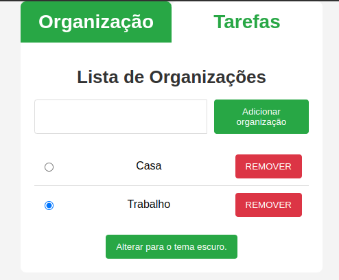
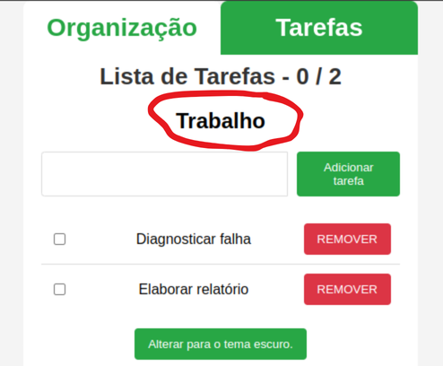

# **Q-fazer**

Aplicação para lista de tarefas.

## **Requisitos**

Projeto desenvolvido em Javascript com React + Typescript + Vite. Necessário NodeJS instalado. 
Esta versão da aplicação foi desenvolvida com NodeJS versão 20.12.0, ReactJS versão 19.0.0, ReactDom versão 19.0.0, React Router DOM versão 7.1.0, Typescript versão 5.7.3 e Vite versão 5.4.9.
Testes realizados nos navegadores Google Chrome versão 127.0.6533.88 e Firefox versão 133.0.3 .

## **Melhorias com relação a Versão 1**

A versão anterior disponibiliza uma lista com opção de adicionar novos itens e marcar os itens já executados, além de poder remover qualquer item. Tudo salvo na memória do navegador (localStorage). 
Nesta nova versão as informações ainda são salvas no localStorage, porém foi adicionada uma página onde são listadas as organizações às quais as tarefas se refeream, sendo cada lista de tarefas associada a apenas uma organização.  
 
Página de organizações  
 
Em destaque a organização à qual as tarefas se referem 

O quê desenvolver neste projeto:

- (OK) Uma barra superior com uma aba "Organização" e outra aba "Tarefas";
- (OK) Na aba "Organização" criar campo para adicionar empresa, grupo ou local ao qual as tarefas se referem (localStorage);
- (OK) Na aba "Organização" criar lista selecionável de organizações (radio button);
- (OK) A aba tarefas deverá mostrar as tarefas pertinentes à organização selecionada;
- O projeto deverá estar disponível num site para uso de todos;
- Atender os requisitos do desafio 4 DNC.
