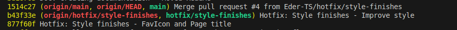

# **Q-fazer**

Aplicação para lista de tarefas.

## **Requisitos**

Projeto desenvolvido em Javascript com React + Typescript + Vite. Necessário NodeJS instalado.<br>
Esta versão da aplicação foi desenvolvida com NodeJS versão 20.12.0, ReactJS versão 19.0.0, ReactDom versão 19.0.0, React Router DOM versão 7.1.0, Typescript versão 5.7.3 e Vite versão 5.4.9.
Testes realizados nos navegadores Google Chrome versão 127.0.6533.88 e Firefox versão 133.0.3 .<br>
Após clonar o projeto na sua máquina, instale as dependências com o comando `npm install`.<br>
Para executar o projeto deve-se usar o comando `npm run dev` na linha de comando (estando dentro da pasta do projeto).

## **Melhorias com relação a Versão 1**

A versão anterior disponibiliza uma lista com opção de adicionar novos itens e marcar os itens já executados, além de poder remover qualquer item. Tudo salvo na memória do navegador (localStorage).<br>
<br>
Versão 1<br><br>
Nesta nova versão as informações ainda são salvas no localStorage, porém foi adicionada uma página onde são listadas as organizações às quais tarefas específicas podem ser adicionadas, sendo cada lista de tarefas associada a apenas uma organização.<br><br>
<br>
Página de organizações<br><br>
<br>
Em destaque a organização à qual as tarefas se referem<br><br>
Inicialmente foi adicionado uma navabar com os botões para alternar entre as páginas.<br>
<br><br>

```
export const Navbar = () => {

const { theme, toggleTheme } = useTheme()

const organization = ''

const tasks = ''

const actualTab = window.document.location.href.endsWith('/')

    return (
        <nav className={`navbar ${theme}`}>
            <NavbarButton
                href='/'
                linkText='Organização'
                isActive={
                    actualTab ? 'active' : ''
                }
            />

            <NavbarButton
                href='/tarefas'
                linkText='Tarefas'
                isActive={
                    actualTab ? '' : 'active'
                }
            />
        </nav>
    )

}
```

Código navbar<br><br>

```
export function NavbarButton(props: NavbarButtonProps) {
    const { href, linkText, isActive } = props

    // eslint-disable-next-line @typescript-eslint/no-unused-vars
    const { theme, toggleTheme } = useTheme()

    return (
        <Link
            className={`button ${theme} ${isActive}`}
            to={href}
        >
            {linkText}
        </Link>
    )
}
```

Código botôes de navegação<br><br>

```
export interface NavbarButtonProps {
  href: string;
  linkText: string;
  isActive: "active" | "";
}
```

Um tipo também foi criado para definir os botões de navegação<br><br>
Então foram criadas as páginas.<br>
<br><br>
O corpo da página de Organizações é semelhante a página de Tarefas que herdou o código da versão 1.<br>

```
return (
        <div className={`app ${theme}`}>

            <Navbar />

            <div className={`container ${theme}`}>

                <h1>Lista de Organizações</h1>

                <div className='input-container'>
                    <input type="text" value={newOrganization} onChange={(e) => setNewOrganization(e.target.value)} />
                    <button onClick={addOrganization}>Adicionar organização</button>
                </div>

                <ol>
                    {
                        organizations.map((organization) => (
                            <li key={organization.id}>
                                <input
                                    type="radio"
                                    name='organization'
                                    value={organization.name}
                                    checked={selectedOrganization === organization.name}
                                    onChange={selectOrganization}
                                />

                                <span style={{ textDecoration: organization.done ? 'line-through' : 'none' }}>
                                    {organization.name}
                                </span>

                                <button onClick={() => removeOrganization(organization.id)}>REMOVER</button>
                            </li>
                        ))
                    }
                </ol>

                <button onClick={toggleTheme}>
                    Alterar para o tema {theme === "dark" ? "claro." : "escuro."}
                </button>
            </div>
        </div>
    )
```

Organization.tsx<br><br>

```
return (
        <div className={`app ${theme}`}>

            <Navbar />

            <div className={`container ${theme}`}>

                <h1>Lista de Tarefas - {getDoneTasks().length} / {todos.length}</h1>

                <h2>{organization}</h2>

                <div className='input-container'>
                    <input type="text" value={newTodo} onChange={(e) => setNewTodo(e.target.value)} />
                    <button
                        className="tooltip"
                        onClick={addTask}
                        disabled={organization ? false : true}
                    >Adicionar tarefa</button>
                </div>

                <ol>
                    {
                        todos.map((todo) => (
                            <li key={todo.id}>
                                <input type="checkbox" checked={todo.done} onChange={() => markTask(todo.id)} />

                                <span style={{ textDecoration: todo.done ? 'line-through' : 'none' }}>
                                    {todo.text}
                                </span>

                                <button onClick={() => removeTask(todo.id)}>REMOVER</button>
                            </li>
                        ))
                    }
                </ol>

                <button onClick={toggleTheme}>
                    Alterar para o tema {theme === "dark" ? "claro." : "escuro."}
                </button>
            </div>
        </div>
    )
```

Tasks.tsx<br><br>
Para a navegação funcionar foi implementado o React Router Dom no arquivo App.tsx.

```
function App() {
  return (
    <BrowserRouter>
      <Routes>
        <Route path="/" element={<Organization />} />
        <Route path="/tarefas" element={<Tasks />} />
      </Routes>
    </BrowserRouter>
  )
}
```

<br>
Então o fluxo entre as páginas pôde ser criado e organizado.<br>
<br><br>
Na primeira renderização em Organization.tsx é conferida a memória local se há alguma organização e carrega o array de organizações com a mesma.<br>

```
useEffect(() => {
    const memoryOrganization = localStorage.getItem(memoryOrganizationKey)

    if (memoryOrganization) {
        setOrganizations(JSON.parse(memoryOrganization))
    }

    setIsLoaded(true)

}, [])
```

<br>
Carrega o array de organizações na memória após a memória ser conferida na renderização da página ou o array de organizações ser atualizado.<br>

```
useEffect(() => {
    if (isLoaded && organizations.length > 0) {

        localStorage.setItem(memoryOrganizationKey, JSON.stringify(organizations))
    }
}, [organizations, isLoaded])

```

<br>
Prepara o nome da organização selecionada.<br>

```
const selectOrganization = (event: { target: { value: SetStateAction<string> } }) => {
    setSelectedOrganization(event.target.value)}

```

<br>
Guarda na memória o nome da organização selecionada.<br>

```
useEffect(() => {
    if (selectedOrganization) {
        localStorage.setItem(selectedOrganizationKey, selectedOrganization)
    }
}, [selectedOrganization])

```

<br>
Seta a organização atual selecionada.<br>

```
useEffect(() => {
    const memorySelectedOrganization = localStorage.getItem(selectedOrganizationKey)
    if (memorySelectedOrganization) {
        setSelectedOrganization(memorySelectedOrganization)
    }
}, [])

```

<br>
A função de excluir organização exclui qualquer tarefa desta organização que ainda esteja na memória, além de limpar qualquer registro da memória quando é excluído o último item.<br>

```
const removeOrganization = (id: string): void => {
    const updateOrganizations = organizations.filter((organization) => organization.id !== id)
    setOrganizations(updateOrganizations)

    if (updateOrganizations.length > 0) {
        setSelectedOrganization(updateOrganizations[0].name)
    }

    const clearOrganizationTasks = organizations.find((organization) => organization.id === id)
    const toClear = clearOrganizationTasks?.name
    if (localStorage.getItem(`${toClear}-tasks`)) {
        localStorage.removeItem(`${toClear}-tasks`)
    }

    if (updateOrganizations.length == 0) {
        localStorage.removeItem(memoryOrganizationKey)
        localStorage.removeItem(selectedOrganizationKey)
    }
}

```

<br>
Todo este tratamento com `selectedOrganization` serve para manter a coesão da informação na memória. Esta informação será usada na página de tarefas (Tasks.tsx) para mostrar as tarefas corretas.<br>
A seguir, já em Tasks.tsx, é buscado na memória se há uma organização que foi selecionada em Organization.tsx.<br>
O array na memória ganha o nome da organização, seguido de `-tasks` para indicar a lista de tarefas daquela organização.<br>

```
const organization = localStorage.getItem('selectedOrganization')

useEffect(() => {
    if (organization) {
        setMemoryTasksKey(`${organization}-tasks`)
    }
}, [])

```

<br>
A constante `organization` também serve para habilitar o botão de adicionar tarefas, impedindo que tarefas sejam criadas se não existir uma organização.<br>

```
<div className='input-container'>
    <input type="text" value={newTodo} onChange={(e) => setNewTodo(e.target.value)} />
    <button
        className="tooltip"
        onClick={addTask}
        disabled={organization ? false : true}
    >Adicionar tarefa</button>
</div>

```

<br>
Neste hook é atualizado o array de tarefas na memória (por qualquer motivo que o array da aplicação seja atualizado), neste momento é chamada a arrow function `areAllDone`...<br>

```
useEffect(() => {
    if (isLoaded && todos.length > 0 && organization) {
        localStorage.setItem(memoryTasksKey, JSON.stringify(todos))

        areAllDone()
    }
    // eslint-disable-next-line react-hooks/exhaustive-deps
}, [todos, isLoaded])

```

<br>
...Estando todas as tarefas "prontas" a organização é marcada como `Done` no array de organizações na memória. Isso fará com que o nome da organização apareça taxado na página de organizações, dando uma indicação visual de que todas as tarefas daquela organização foram executadas. Isso evita de o usuário ter de abrir a aba de tarefas de cada organização.<br>

```
const areAllDone = () => {
    const areAllDone = todos.every((todo) => {
        return todo.done
    })

    const organizations = localStorage.getItem('organizations')
    const actualOrganizationMemory = organization
    if (areAllDone && organizations && actualOrganizationMemory) {
        const organizationsObject: OrganizationItem[] = JSON.parse(organizations)
        const thisOrganization = organizationsObject.find((organization) => { return organization.name === actualOrganizationMemory })
        const idThisOrganization = thisOrganization?.id
        const updateOrganizations = organizationsObject.map((organization) => {
            if (organization.id === idThisOrganization) {
                return { ...organization, done: organization.done = true }
            }
            return organization
        })

        localStorage.setItem('organizations', JSON.stringify(updateOrganizations))
    }
}
```

<br>
A arrow function de deletar tarefas também teve de ser atualizada, pois não estava excluindo o último ítem da memória quando era excluído o último ítem do array da aplicação.<br>

```
const removeTask = (id: string): void => {
    const updateTodos = todos.filter((todo) => todo.id !== id)
    setTodos(updateTodos)

    if (updateTodos.length == 0) {
        localStorage.removeItem(memoryTasksKey)
    }
}

```

<br>

Outras funções não foram descritas pois já são herdadas da versão 1 como, por exemplo, as funções de criar as listas na memória que são usadas em ambas as páginas nesta versão.<br>
Algumas melhorias também foram feitas na folha de estilos, tanto para mostrar o botão correto da cada aba como acertos no modo escuro.<br>
<br><br>
Classes que controlam o estilo da navbar e dos botões da mesma.<br>

```
.navbar {
  position: fixed;
  top: 0;
  display: flex;
  align-items: center;
  justify-content: space-around;
  width: 440px;
}

.button {
  background: #fff;
  color: #28a745;
  font-size: 28px;
  font-weight: 600;
  display: flex;
  justify-content: center;
  align-items: center;
  width: 50%;
  height: 60px;
  text-decoration: none;
  border-radius: 8px 8px 0 0;
}

.button.dark {
  background: #333;
  color: #fff;
}

.button.active {
  background: #28a745;
  color: #fff;
}

.button.dark.active {
  background: #222;
}

```

## **Exemplo de uso**

[](https://youtu.be/S1GEhu6aTZE)
